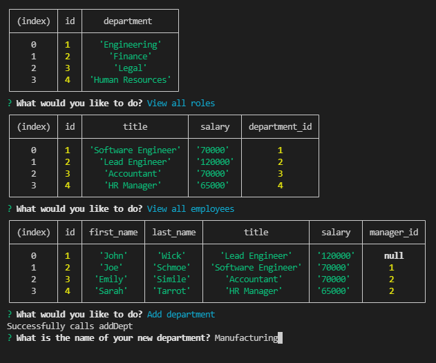

# 12 SQL: Employee Tracker

## Description

An content management system that generates a database for employee information. The application will build out the database with command line prompts.


## User Story

```md
AS A business owner
I WANT to be able to view and manage the departments, roles, and employees in my company
SO THAT I can organize and plan my business
```

## Result

The following image shows an example of the application being used from the command line:



## Walk-through


## Tools used

* NodeJs
* MySQL2
* Express
* Inquirer

## GitHub
